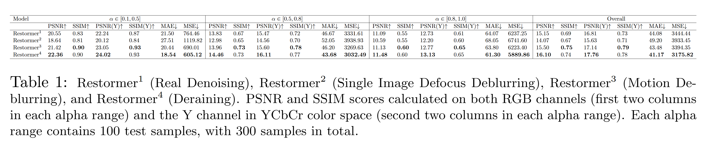

### intro
- Repo for evalute paper: [Restormer: Efficient Transformer for High-Resolution Image Restoratio](https://arxiv.org/abs/2111.09881).
- Code adapted from [author released notebook](https://colab.research.google.com/drive/1C2818h7KnjNv4R1sabe14_AYL7lWhmu6?usp=sharing).

### new data
- Created dataset: [./test_data/metadata.json](./test_data/metadata.json)
  - alpha ranges [0.1-0.5, 0.5-0.8, 0.8-1.0]
  - mask random scale [1.0-1.2]
  - mask random crop
  - size: 3x100 = 300 images (3 alpha ranges, other parameters fixed)
- Script: [./image_gen.ipynb](./image_gen.ipynb)
- Visual:  
  

### eval results
- Script: [./restormer_eval.ipynb](./restormer_eval.ipynb)
- Table ([./assets/table.tex](./assets/table.tex)):  
  
- Visual:  
  
